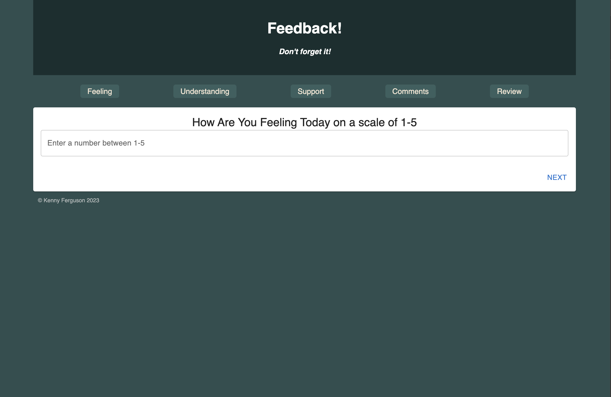

)

# Feedback Loop

## Description

Feedback Loop is a web-based application designed to gather and present feedback. Built using Javascript, React, CSS, HTML, and Redux, it offers a blend of server-side logic and client-side interactions. The main purpose of this project was to streamline the feedback process by collecting user responses and presenting them in a user-friendly manner.

## Screen Shot

### Prerequisites

- [Node.js](https://nodejs.org/en/)
- [Postgres](https://www.postgresql.org/download/)
- [Postico 2](https://eggerapps.at/postico2/)

## Installation

1. Create a database named `prime_feedback`.
2. The queries in the `tables.sql` file are set up to create all the necessary tables and populate the needed data to allow the application to run correctly.
3. Open up your editor of choice and run `npm install`.
4. Run `npm run server` in your terminal.
5. Run `npm run client` in your terminal.
6. The `npm run client` command will open up a new browser tab for you!

## Usage

1. Navigate to the main page.
2. Fill in the feedback form.
3. User can go back a previous page or click the nav bar at the top to change data
4. Submit the form.
5. View the list of feedbacks on the dashboard.

## Built With

- React
- Redux
- Node.js
- Express
- PostgreSQL
- Javascript
- CSS
- Axios
- Material UI
- Postico 2
- Postman (for testing routes)
- Git
- Github
- Nodemon (for development)
- VScode

## Snapshots

## License

[MIT](https://choosealicense.com/licenses/mit/)

## Acknowledgement

Thanks to [Emerging Digital Academy](https://emergingacademy.org/) for providing the foundational knowledge and tools to develop this application. Special thanks to mentors and peers who provided valuable feedback and insights.

## Support

If you have suggestions or issues, please email me at [kenneth.w.ferguson2@gmail.com](mailto:kenneth.w.ferguson2@gmail.com)
